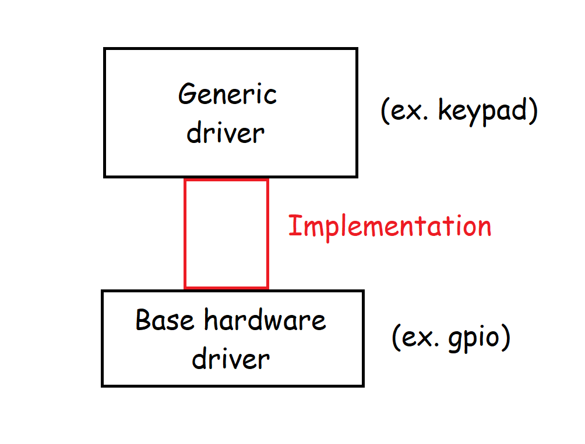
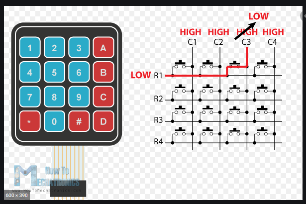

# Generic drivers
## What are generic drivers?
Software that allow us to control different devices (like keypads, lcd16x2 or hc50) using any base architecture(like avr, pic or arm).
## How to add generic drivers to your project?
Just add them to your project directory(like any other standard library), link them with you compiler and implement the base firmware that each one require. Take next picture as a reference.

 </img>

## How to implement a generic driver? 
* Take "selector_keypad" as example.
* Any generic driver allow us to create generic objects:
```c
keypad_t my_keypad;
```
* But they are incomplete, their function attributes(4 in this case) are not defined :
```c

typedef void (* init_hardware)(void);
typedef void (*set_row_as_input_fn)(uint8_t row);      
typedef void (*set_row_as_output_low_fn)(uint8_t row);   
typedef uint8_t (*get_column_value_fn)(uint8_t column);  

typedef struct {
    uint8_t rows;
    uint8_t columns;
    init_hardware init;
    set_row_as_input_fn set_row_as_input;
    set_row_as_output_low_fn set_row_as_output_low;
    get_column_value_fn get_column_value;
} keypad_t;
```
* So the programmer should complete function attributes listed above to be able to use the keypad api:
```c
void init_keypad(keypad_t* keypad);
uint16_t scan_keypad(keypad_t* keypad);
``` 
* First attribute: "init_hardware init". Is a function that return "void" and receive "void" as a parameter.
A particular case, 4x4 keypad, the horizontal lines(rows) need to be defined as inputs at start up and the
vertical lines(colums) as input pull-up.

 </img>

```c
void my_keypad_init(){
    // set R1,R2,R3,R4 gpios as inputs
    // set C1,C2,C3,C4 gpios as inputs pull-up    
}
``` 
* Second and third attributes: 
```c
void my_keypad_set_row_as_input(uint8_t row){
    // set as input the gpio, accordingly to the argument "row".
    switch( row )
    {
        case R1:
            // set R1 gpio as input
        case R2:
            // set R2 gpio as input
        ...
    }
}
void my_keypad_set_row_as_output_low(uint8_t column){
    // set as output (and low logic level) the gpio, accordingly to the argument "column".
    switch( column )
    {
        case C1:
            // set C1 gpio as output (and low logic level)
        case C2:
            // set C2 gpio as output (and low logic level)
        ...
    }
}
``` 
* Fourth attribute:
```c
uint8_t my_keypad_get_column_value(uint8_t column){
    // get the gpio level accordingly to the argument "column"
    switch( column )
    {
        case C1:
            // return C1 gpio level
        case C2:
            // return C2 gpio level
        ...
    }        
}
``` 
* Finally there are two number attributes ("rows" and "columns"). They mean the number of rows and columns of
the keypad in case.
* Create an "implement function" to define your generic objet:
```c
keypad_t my_keypad
uint8_t keypad4x4_implements(uint8_t column){
    my_generic_object.init = my_keypad_init;
    my_generic_object.set_row_as_input = my_keypad_set_row_as_input;
    my_generic_object.set_row_as_output_low = my_keypad_set_row_as_output_low;
    my_generic_object.get_column_value = my_keypad_get_column_value;
    my_generic_object.rows = 4;
    my_generic_object.columns = 4;
}
``` 
* At this point, how to implement a generic driver must te clear. To have a better understand check the examples.
# How to use an implemented generic driver in your application?
* Just call the implementer function, then you must be able to use "scan_keypad" to know what key was pressed on a 
pressed-event.
```c
void main(){
    keypad4x4_implements();
    init_keypad(&my_keypad);
    while(1){
        uint16_t result = scan_keypad(&my_keypad);
        bool key_pressed = result != 0xffff;
        if( key_pressed){
            printf("row:%u - column:%u", result >> 8, result & 0xff );
        }
    }
}
```
* Check examples to have fun.


